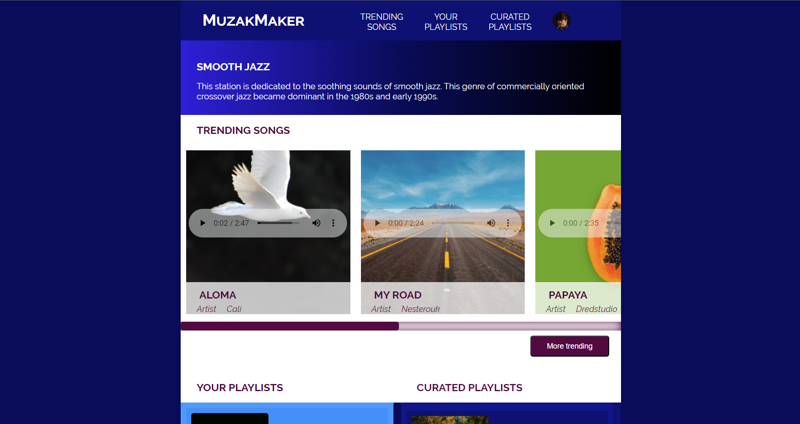

 
<!---->

 MuzakMaker is a responsive website that is dedicated to displaying a curation of the soothing sounds of Jazz music.This website was completed as a class assignment at Arizona State University. This is the <a href= "https://thiggin7.github.io/streamingmedia/">link</a> to my website.

<h3>Features</h3>

This website consists of three navigation links that, when clicked, automatically scolls the page to the specified section of the webpage. The first section, TRENDING SONGS, consists of a horizontal scrollbar in which the user can scroll to see all trending songs and, since these songs have an audio feature, users are also able to listen to the song.

The second section and third section, YOUR PLAYLISTS and CURATED PLAYLIST, respectively provide the title and a short description of each playlist. They also feature horizontal scrollbars.

 
 
Since this website was solely a class assignment to teach us students how to create a responsive website and implement audio features, the profile picture does not lead to a signin page, the playlist and curated playlist, when clicked do not provide further features and the 'more trending' button does not link to another page.

